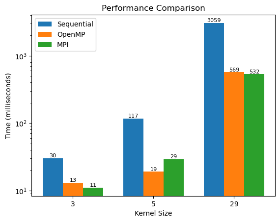

# Parallel Low Pass Filter

## Overview
Welcome to our project! In this repository, we have implemented a low pass filter using both sequential and parallel approaches. The goal is to compare the timing and efficiency of these implementations by leveraging OpenMP and MPI.

## Implementation

### Sequential Approach
The sequential implementation serves as our baseline, providing a straightforward representation of the low pass filter algorithm. It acts as a reference point for comparison against the parallel versions.

### Parallel Approaches
We have employed both OpenMP and MPI to parallelize the low pass filter algorithm, exploring different avenues to enhance performance on multi-core machines and distributed computing environments, respectively.

- **OpenMP Implementation**: OpenMP is used to parallelize the algorithm on shared-memory systems, leveraging the power of multiple cores within a single machine. This approach is particularly beneficial for improving efficiency on modern multicore processors.

- **MPI Implementation**: MPI (Message Passing Interface) is employed for parallelization across distributed systems. This implementation allows the low pass filter algorithm to scale across multiple nodes, offering increased performance on larger datasets and distributed computing infrastructures.

## Performance Comparison

| Kernel Size | Sequential       | OpenMP            | MPI              |
|-------------|------------------|-------------------|------------------|
| 3           | 30 milliseconds  | 13 milliseconds   | 11 milliseconds  |
| 5           | 117 milliseconds | 19 milliseconds   | 29 milliseconds  |
| 29          | 3059 milliseconds| 569 milliseconds  | 532 milliseconds |

